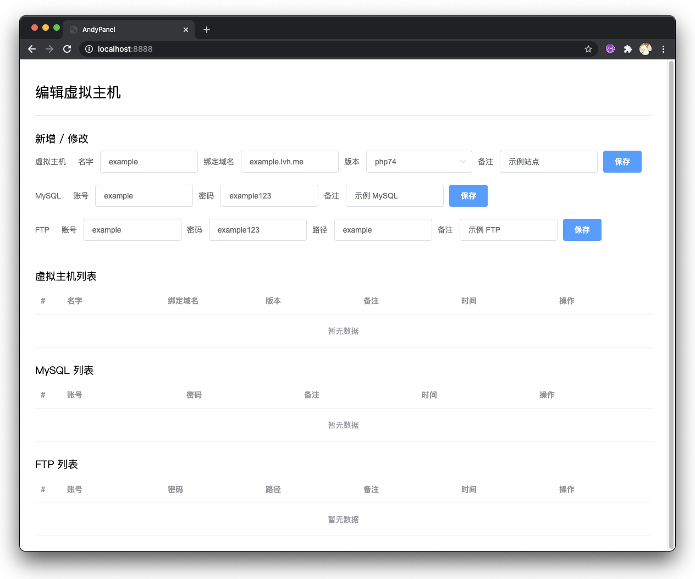

# AndyPanel
Virtual host management panel for Docker Container Platform.


## Includes
PHP 5.6 ,
PHP 7.4 ,
PHP 8.0 ,
MySQL 8 ,
Adminer ,
Caddy ,
Pure-FTPd .

## Supported platforms
Windows ( including WSL 2 ), macOS, Ubuntu, CentOS, Linux, Unix.

## Prerequisites
Install [Docker](https://docs.docker.com/engine/install/) and [Docker Compose](https://docs.docker.com/compose/install/).

## Install

```bash
git clone https://github.com/mingfunwong/AndyPanel.git
cd ./AndyPanel
cp ./panel/server/.env.example ./panel/server/.env
vi ./docker-compose.yml # set MYSQL_ROOT_PASSWORD
vi ./panel/server/.env # set LOGIN_USERNAME LOGIN_PASSWORD MYSQL_PASSWORD(same MYSQL_ROOT_PASSWORD) JWT_SECRET(Random string)
sudo docker-compose up -d
```

### Guide
`http://localhost:8888/` access Control panel. ( Username: ``LOGIN_USERNAME``, Password: ``LOGIN_PASSWORD`` )  
`http://localhost:8080/` access MySQL Adminer panel. ( Server: ``mysql``, Username: ``root``, Password: ``MYSQL_ROOT_PASSWORD`` )

## Author
[Mingfun Wong](https://github.com/mingfunwong)

## License
MIT License
